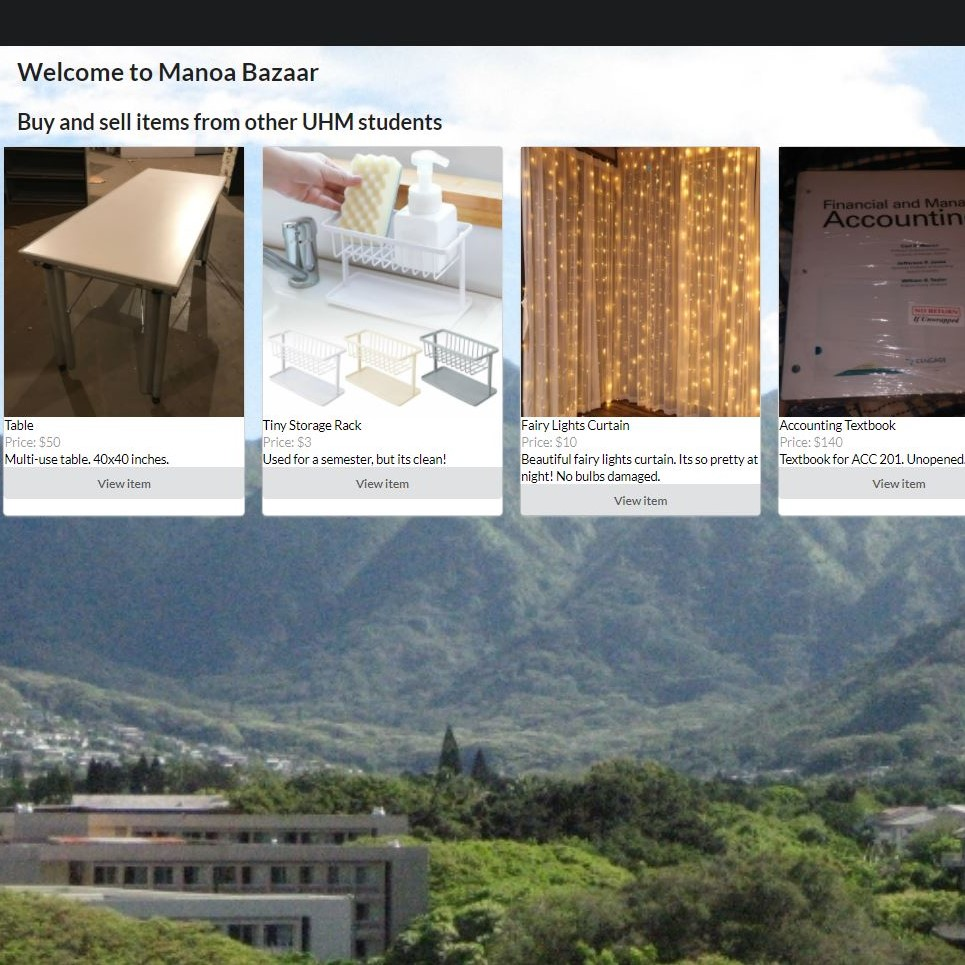

  

## My Latest Project
In my latest evolutionary stage as a Computer Science student, a group of us were tasked with throwing together what we’ve learned thus far in Software Engineering to create usable end products. In our case, it was a fully functional website that helps UH Manoa students buy and sell goods to each other. As a student who has lived on campus, I frequently see piles of perfectly good items sitting at the dumpster at the end of the semester. Things such as TV’s, fridges, school supplies, and the like tossed haphazardly as students don’t have the time or have made proper arrangements to sell off all of their belongings before they have to leave. With a dedicated website, students can easily make an account, sign in, and list their items. Not only can a student list their items, he or she can come back and edit the listing if he or she wants to sell his or her items faster.  

## The Landing Page
My duties for the website were to create the landing page and create unity between the pages to look uniform. The landing page has an additional feature that randomly spits out 4 listings whenever the user refreshes the page. This way, the user can quickly browse through items and see if anything catches his or her attention. The landing page was purposely left simple in order to focus the attention to the listings on the backdrop of the beautiful Manoa Valley. As the site evolved from a mockup to being functional, the landing page made its way through multiple versions to arrive to the current state. 

## Onwards
This project indeed tested the concepts we learned and practiced all semester. From learning Javascript to CSS and HTML and then layering user interface frameworks and functional programming, I was able to demonstrate the fruits of my labor and create a product that culminated all of my experience thus far as a Computer Science student. I am very proud of the progress I have made throughout the semester and know I will continue to be using these concepts in future projects. One day I may need to create a website from scratch, but now that I know how to automatically format my code using ESLint into acceptable coding standards and employ user interface frameworks to make my website look aesthetically pleasing and functional, it’ll definitely be easier the second time around. The possibilities are endless.
